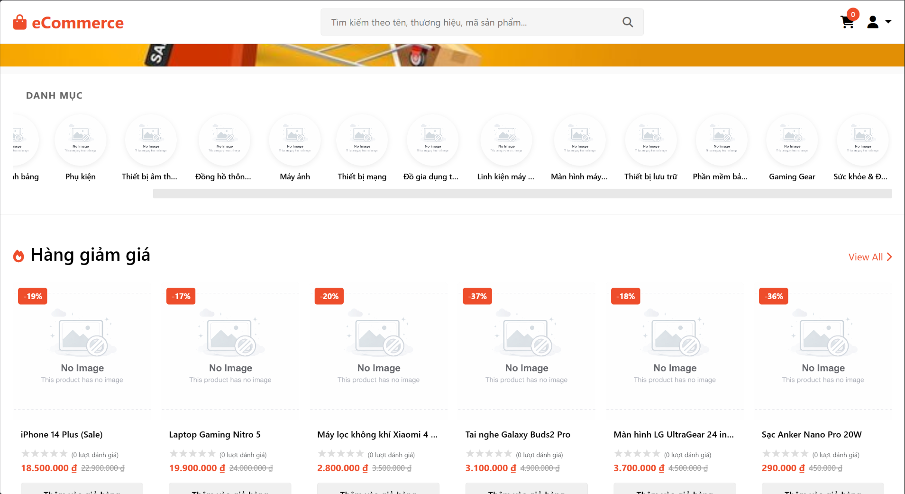
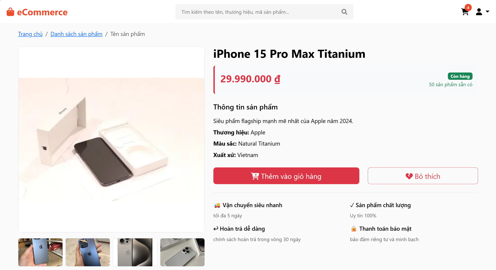
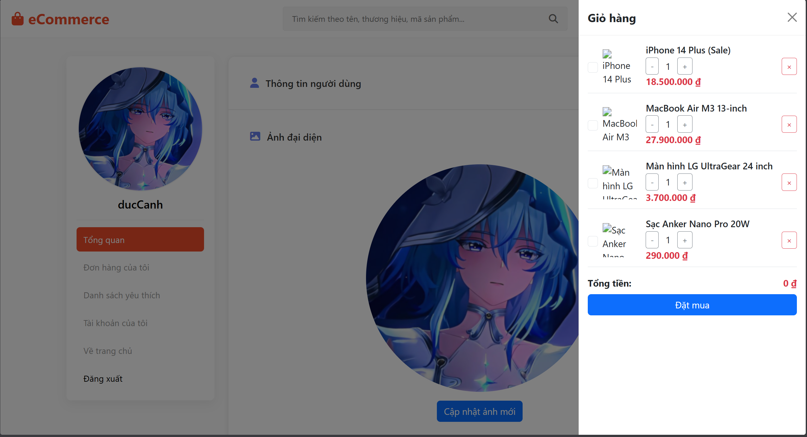
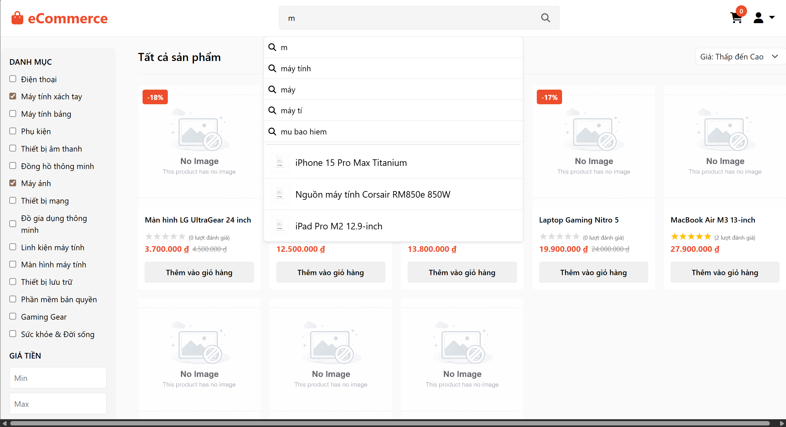
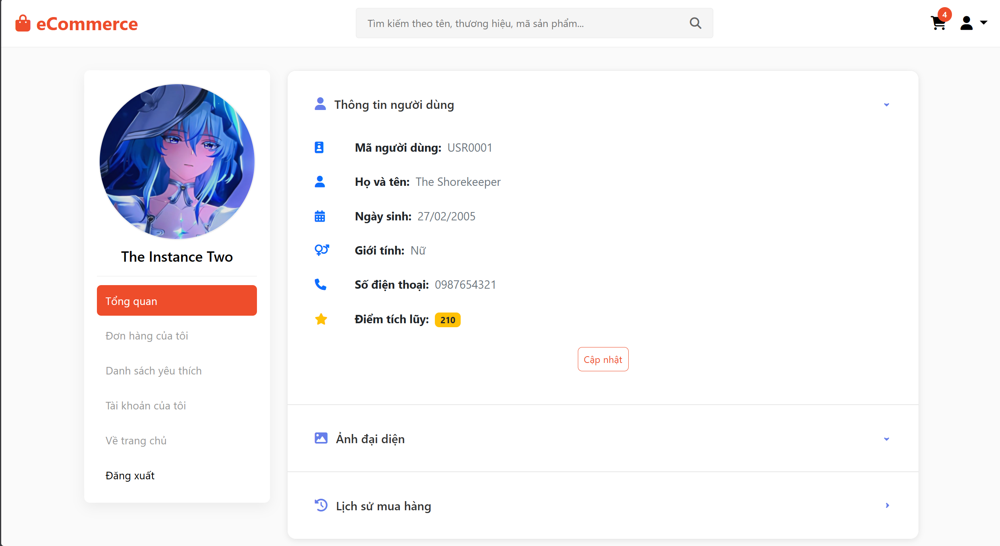

# eCommerce Website


A simple **eCommerce web application** built with **Spring Boot** and **Vanilla JavaScript**.

This project focuses mainly on **backend development**, while the frontend is a lightweight UI that consumes REST APIs from the backend.

---

## Tech Stack

### Backend
- Spring Boot
- Spring Security
- MySQL
- Redis
- JWT
- OAuth2 (Google, Facebook)
- Cloudinary

### Frontend
- HTML
- Bootstrap 5
- CSS
- Vanilla JavaScript

---

## Features

### Product
- Product browsing
- Product detail
- Product filtering (name, category, price)
- Sorting

### User
- Authentication (Local, Google, Facebook)
- Forgot password with OTP (Redis + Email)
- User profile management

### Shopping
- Shopping cart (stored in Redis)
- Order management
- Wishlist
- Product reviews

### Search
- Search suggestions
- Redis Sorted Set (ZSET) for keyword ranking

### Media
- Image upload via Cloudinary

---

## Screenshots

### Home Page



### Product Detail



### Cart



### Search-filter



### Profile



---

## Project Structure
````
ecommerce-project
├── ecommerce-fe # Frontend (HTML + Bootstrap + JS)
└── ecommerce-be # Backend  (Spring Boot)
````


---

## Run Project

### Backend

```bash
  cd ecommerce-be
 ./mvnw spring-boot:run
```


### Frontend

Open HTML files directly or run with a local server.

---

## Author

Backend-focused learning project for practicing:

- Spring Boot
- Redis
- Authentication & Authorization
- REST API design

Currently seeking opportunities to gain real-world backend development experience.