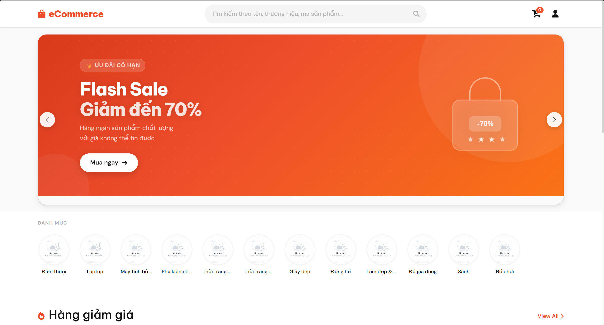
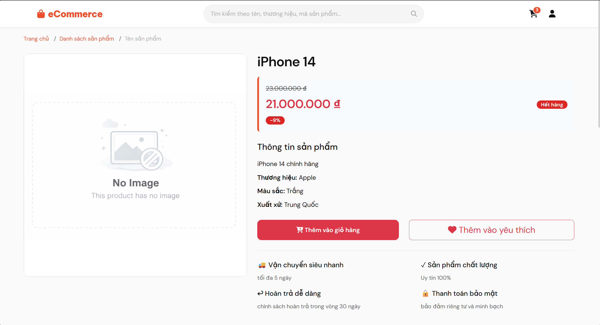
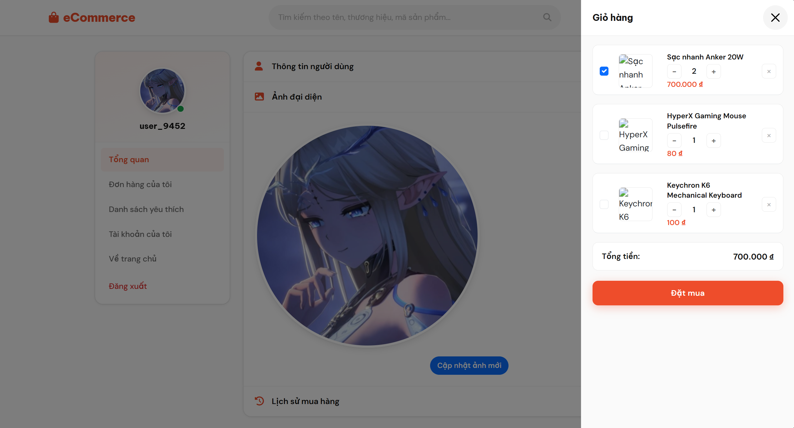
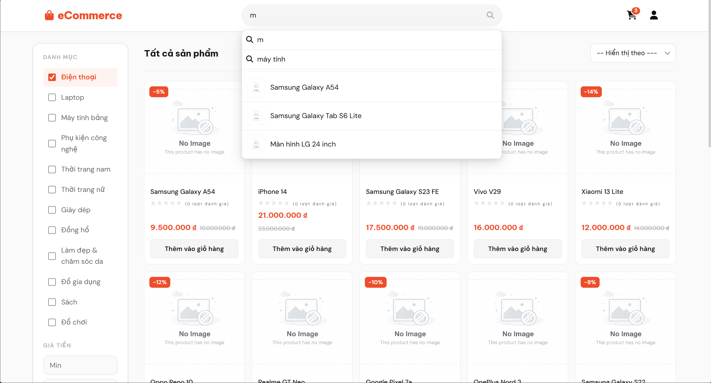
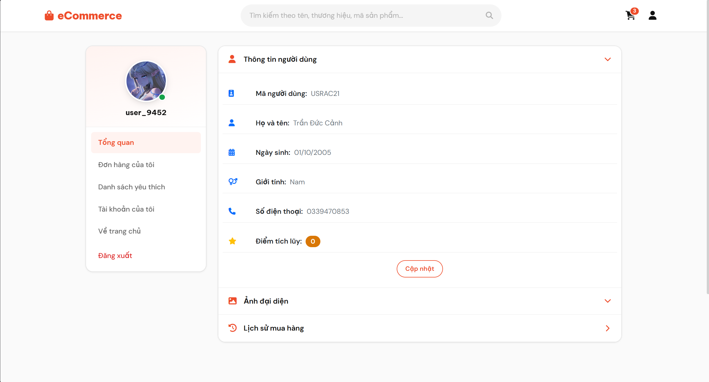

# eCommerce Website


A **full-stack eCommerce web application** built with **Spring Boot** and **Vanilla JavaScript**.

This project focuses mainly on **backend development**, covering authentication, security, caching, performance optimization, and containerization. The frontend is a lightweight UI that consumes REST APIs from the backend.

---

## Tech Stack

### Backend
- Java 21 + Spring Boot 3
- Spring Security + JWT + OAuth2 (Google, Facebook)
- Spring Data JPA + Hibernate
- MySQL + Redis
- Cloudinary (image storage)
- MapStruct (DTO mapping)
- Swagger UI (API documentation)
- JUnit + Mockito (unit & integration testing)
- Docker + Docker Compose

### Frontend
- HTML + Bootstrap 5 + CSS
- Vanilla JavaScript

---

## Features

### Authentication & Security
- Register / Login (Local + Google + Facebook via OAuth2)
- Account merging — link OAuth2 account to existing local account (same email)
- JWT authentication with refresh token rotation
- Bcrypt password encoding
- Forgot password via OTP (generated, sent, stored in Redis with TTL)
- Rate limiting (Redis-backed) against brute force:
  - OTP: max 5 requests, max 3 wrong attempts
  - Login: max 5 wrong attempts → temporary account lock (15 minutes)
- Method-level security with `@PreAuthorize`
- RBAC with 4 roles: `guest`, `user`, `admin`, `seller`

### Product
- Product listing, detail, and filtering (name, category, price range, sorting)
- Products on sale, products by category
- Product suggestions (Redis ZSET — keyword ranking by search frequency)

### Shopping
- Cart stored in Redis (Hash + TTL)
- Order placement with **Pessimistic Locking** (prevent overselling under concurrent requests)
- Order history and detail
- Wishlist (add / remove)
- Product reviews

### User
- Profile view & update
- Avatar upload (Cloudinary)
- Purchase history

### Search
- Full-text product search with filters
- Search keyword suggestions ranked by popularity (Redis Sorted Set)

### Media
- Upload images to Cloudinary (avatar, product images, category images)
- Database stores only the URL

### API & Docs
- 40+ REST APIs
- Standardized response with `ApiResponse` + `ResponseEntity` + DTO
- Global exception handling (`@RestControllerAdvice`) + `ErrorCode` enums
- Input validation + custom validator (age ≥ 15)
- Swagger UI with controller-grouped documentation

### Testing
- **Unit tests** (JUnit + Mockito): AccountService, AuthenticationService, JWT handler
- **Integration tests** (H2 in-memory): login, role-based access control

### DevOps
- Dockerfile to build backend image
- Docker Compose to orchestrate BE + MySQL + Redis containers
- Health check to ensure MySQL is ready before backend starts
- Named volumes for data persistence

---

## Screenshots

### Home Page


### Product Detail


### Cart


### Search & Filter


### Profile


---

## Project Structure

```
ecommerce-project
├── ecommerce-fe    # Frontend (HTML + Bootstrap + JS)
└── ecommerce-be    # Backend  (Spring Boot)
```

---

## Run Project

### Backend

```bash
cd ecommerce-be
./mvnw spring-boot:run
```

### With Docker Compose

```bash
cd ecommerce-be
docker compose up -d
```

### Frontend

Open HTML files directly or serve with a local server.

---

## Author

Personal full-stack project built for practicing and demonstrating backend development skills:

- Spring Boot + Spring Security
- Redis caching & data structures
- Authentication & Authorization (JWT, OAuth2, RBAC)
- Performance optimization (N+1 prevention, Pessimistic Lock)
- Testing (Unit + Integration)
- Containerization with Docker

Currently seeking opportunities to gain real-world backend development experience.
